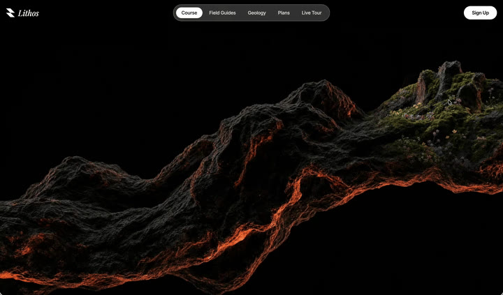
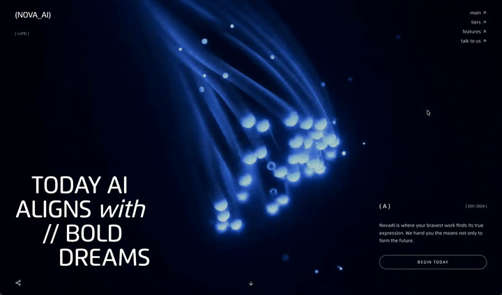
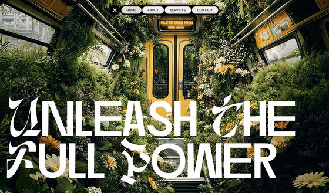
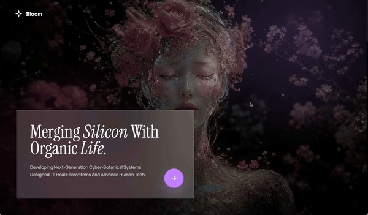
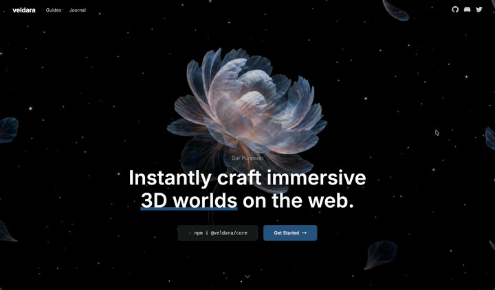

# xuanxuan-prompts

一组用来「让 AI Agent 直接复刻精美网页」的提示词合集。

每个子目录就是一个独立的网页项目，里面通常是两份文件：

- `prompt.md` —— 给 Agent 的完整复刻提示词（含字体、颜色、动画、资源 URL、组件结构等所有细节）
- `<目录名>.gif` —— 这个提示词生成出来之后，网站的实际效果录屏（动图），供你预览参考
- `<目录名>.poster.jpg` —— GIF 的首帧封面图，README 里默认显示它，点击才加载完整 GIF

## 怎么用

非常简单：**挑一个你喜欢的目录，把它里面的 `prompt.md` 整段内容丢给任意一个 Coding Agent，让它按提示词生成项目即可。**

实测可用的 Agent：

- [Claude Code](https://claude.com/claude-code)
- [Codex](https://chatgpt.com/codex)
- 其他任何支持长文本 + 代码生成的agent也都可以

典型用法（以 Claude Code 为例）：

```
请按这份提示词生成对应的项目：

<把 prompt.md 的内容粘贴在这里>
```

Agent 会根据提示词输出完整的项目代码（部分是 React + Vite 工程，部分是单文件 HTML），按它的指示运行起来就能得到预览动图里的效果。

## 当前收录

> 预览列默认只显示轻量的**首帧封面图**，**点击封面**即可打开完整的 GIF 动图 —— 这样打开 README 时不会一次性加载所有动图。

| 目录                                            | 类型                                                                                                                                                                            | 预览（点击播放）                                                                                                                                                                                  |
| ----------------------------------------------- | ------------------------------------------------------------------------------------------------------------------------------------------------------------------------------- | ------------------------------------------------------------------------------------------------------------------------------------------------------------------------------------------------- |
| [liquidGlassAgency](./liquidGlassAgency/)       | React + Vite + Tailwind + shadcn/ui + Framer Motion，深色液态玻璃风格的 AI 网页设计工作室落地页                                                                                 | <a href="./liquidGlassAgency/liquidGlassAgency.gif" title="点击播放 GIF"></a>                |
| [interactiveDiscovery](./interactiveDiscovery/) | React + TypeScript + Vite + Tailwind，跟随光标揭示第二张图的地质品牌 Hero                                                                                                       | <a href="./interactiveDiscovery/interactiveDiscovery.gif" title="点击播放 GIF"></a> |
| [blueEyes](./blueEyes/)                         | React + TypeScript + Vite + Tailwind + lucide-react，滚动逐帧刷新视频背景（蓝色光纤汇聚成「数字之眼」）、极简大字排版的深色 AI 落地页 `NOVA_AI`                                 | <a href="./blueEyes/blueEyes.gif" title="点击播放 GIF"></a>                                                             |
| [openDoor](./openDoor/)                         | React 19 + Vite + Tailwind v4 + GSAP + hls.js，滚动擦洗 HLS 视频背景、液态玻璃 About 面板与药丸导航的沉浸式落地页 `Unleash The Full Power`                                      | <a href="./openDoor/opendoor.gif" title="点击播放 GIF"></a>                                                             |
| [basketball](./basketball/)                     | React + TypeScript + Vite + Tailwind + Three.js（@react-three/fiber / drei）+ GSAP，程序化 3D 篮球 + 滚动技术叙事 + 加购飞行动画 + 定制器的高端运动电商微网站 `Slam Dunk Store` | <a href="./basketball/basketball.gif" title="点击播放 GIF"></a>                                                   |
| [bloom](./bloom/)                               | 单文件 HTML，滚动驱动视频预抽帧的赛博植物学叙事页 `Bloom`                                                                                                                       | <a href="./bloom/bloom.gif" title="点击播放 GIF"></a>                                                                            |
| [flower](./flower/)                             | 单文件 HTML，滚动驱动视频帧 + 横向擦除卡片的沉浸式落地页 `Veldara`                                                                                                              | <a href="./flower/flower.gif" title="点击播放 GIF"></a> |
| [helmet](./helmet/) | 「克隆真实站点」型：让 Agent 先安装 `website-offline-archive` skill，再用它离线复刻 F1 车手 Lando Norris 官网 [landonorris.com](https://landonorris.com/)（赛车头盔/护目镜 Hero），而非从零手写 | <a href="./helmet/helmet.gif" title="点击播放 GIF"></a>                                                                       |

## 说明

- 提示词里引用的视频、图片、GIF 都是公网可访问的 CDN 链接，Agent 生成的代码可以直接拉取使用。
- 不同提示词对技术栈的要求不一样（有 React 工程，也有零依赖的单文件 HTML），按 `prompt.md` 里写的来即可。
- 预览列默认显示轻量首帧封面（`.poster.jpg`），点击封面才加载完整 `.gif` 动图，避免打开 README 时一次性加载所有动图。
- GIF 与封面都可以用仓库根目录的 [`mp4-to-gif.sh`](./mp4-to-gif.sh) 一键从 mp4 生成。
- 仓库会持续补充更多复刻提示词，欢迎 PR 提交你自己写的 `prompt.md` + 效果动图（`.gif`）。
