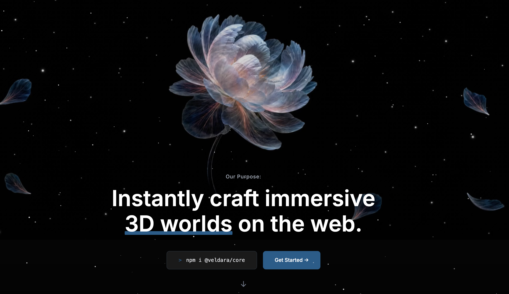

# xuanxuan-prompts

一组用来「让 AI Agent 直接复刻精美网页」的提示词合集。

每个子目录就是一个独立的网页项目，里面只有两份文件：

- `prompt.md` —— 给 Agent 的完整复刻提示词（含字体、颜色、动画、资源 URL、组件结构等所有细节）
- `image.png` —— 这个提示词生成出来之后，网站首页的实际效果截图，供你预览参考

## 怎么用

非常简单：**挑一个你喜欢的目录，把它里面的 `prompt.md` 整段内容丢给任意一个 Coding Agent，让它按提示词生成项目即可。**

实测可用的 Agent：

- [Claude](https://claude.ai) / [Claude Code](https://claude.com/claude-code)
- [Codex](https://chatgpt.com/codex)
- [Kimi](https://www.kimi.com/)
- 其他任何支持长文本 + 代码生成的模型也都可以

典型用法（以 Claude Code 为例）：

```
请按这份提示词生成对应的项目：

<把 prompt.md 的内容粘贴在这里>
```

Agent 会根据提示词输出完整的项目代码（部分是 React + Vite 工程，部分是单文件 HTML），按它的指示运行起来就能得到 `image.png` 里的效果。

## 当前收录

| 目录 | 类型 | 预览 |
| --- | --- | --- |
| [Liquid Glass Agency](./Liquid%20Glass%20Agency/) | React + Vite + Tailwind + shadcn/ui + Framer Motion，深色液态玻璃风格的 AI 网页设计工作室落地页 |  |
| [Interactive Discovery](./Interactive%20Discovery/) | React + TypeScript + Vite + Tailwind，跟随光标揭示第二张图的地质品牌 Hero |  |
| [bloom](./bloom/) | 单文件 HTML，滚动驱动视频预抽帧的赛博植物学叙事页 `Bloom` |  |
| [flower](./flower/) | 单文件 HTML，滚动驱动视频帧 + 横向擦除卡片的沉浸式落地页 `Veldara` |  |

## 说明

- 提示词里引用的视频、图片、GIF 都是公网可访问的 CDN 链接，Agent 生成的代码可以直接拉取使用。
- 不同提示词对技术栈的要求不一样（有 React 工程，也有零依赖的单文件 HTML），按 `prompt.md` 里写的来即可。
- 仓库会持续补充更多复刻提示词，欢迎 PR 提交你自己写的 `prompt.md` + 效果图。
